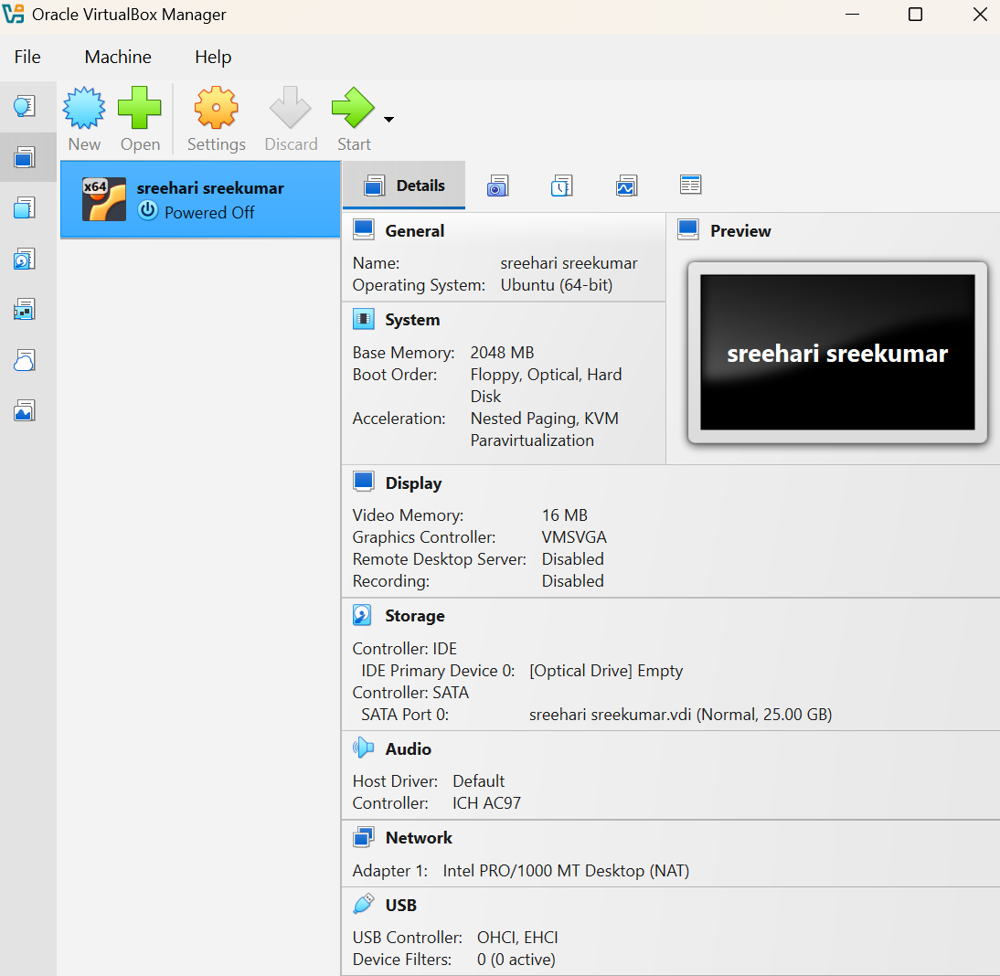
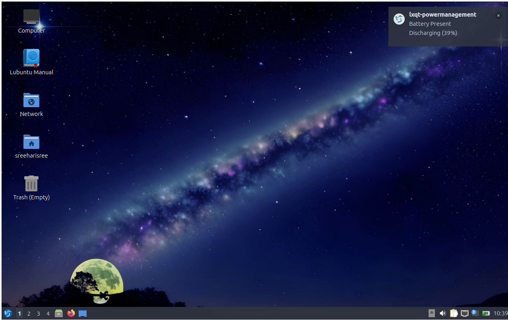
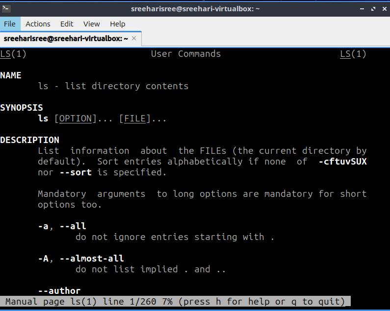
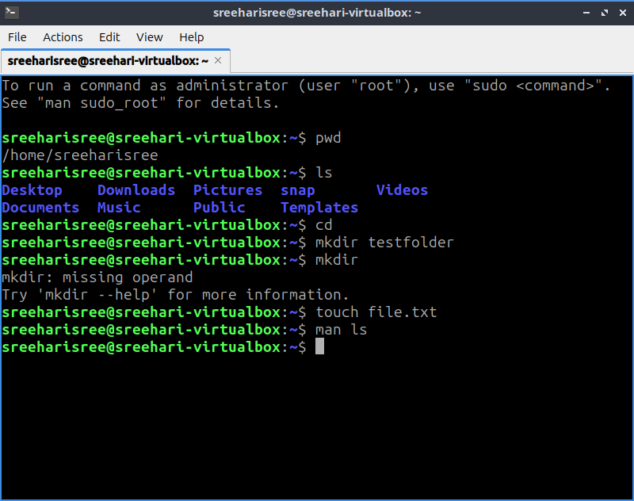

# BRG-ISEA-Lab#
## Session 1a: Linux Setup
### Objective
Install Ubuntu and practice basic Linux commands.
---
### Ubuntu Installation

I installed Ubuntu using VirtualBox and successfully booted into the system.

### Screenshot

---

### Linux Commands

Commands used:

* pwd
* ls
* mkdir labtest
* touch file1.txt

### Screenshot

---

### Reflection

In this lab, I learned how to install Ubuntu and use basic Linux commands. It was my first time using a virtual machine, and I understood how file creation and navigation works in Linux.

---
s
