# BRG-ISEA-Lab#
## Student Name: Sreehari Sreekumar (CT0390740)
## MU id: 36030565
## Session 1a: Linux Setup
### Objective
Install Ubuntu and practice basic Linux commands.
---
### Ubuntu Installation
I installed Ubuntu using VirtualBox and successfully booted into the system.
### Screenshot


---
### Linux Commands
Commands used:
* pwd
* ls
* mkdir labtest
* touch file1.txt
### Screenshot
)


---
### Reflection
In this lab, I learned how to install Ubuntu and use basic Linux commands. It was my first time using a virtual machine, and I understood how file creation and navigation works in Linux.
---
s

# Session 1b: Exploring Linux
## Services
I used systemctl to view and check system services.
### Commands
systemctl list-units --type=service
sudo systemctl status ssh
### Screenshot
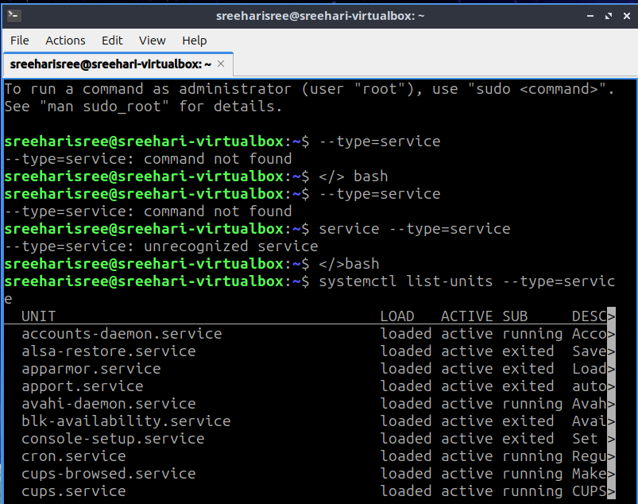
---
## Permissions
I explored file permissions using ls -l and changed permissions using chmod.
### Commands
ls -l
chmod 755 file1.txt
### Screenshot
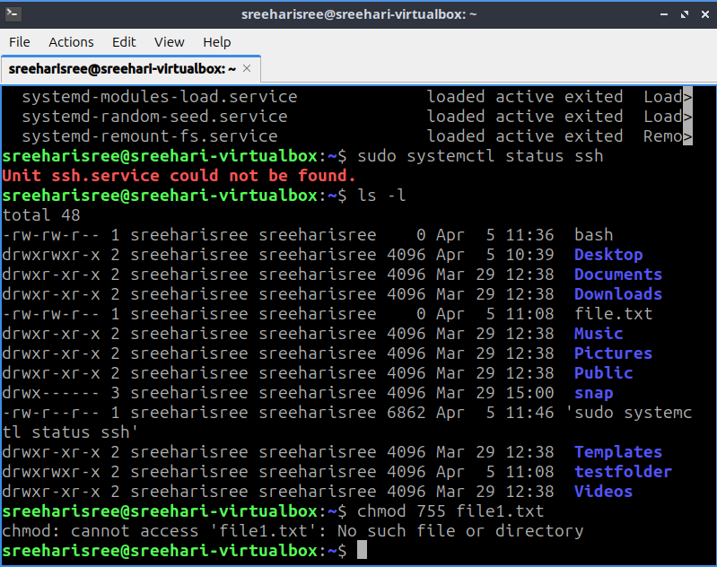
---
## Searching Files
I used find and grep to search for files and content.
### Commands
find /home -name file1.txt
grep -r "test" /home
### Screenshot
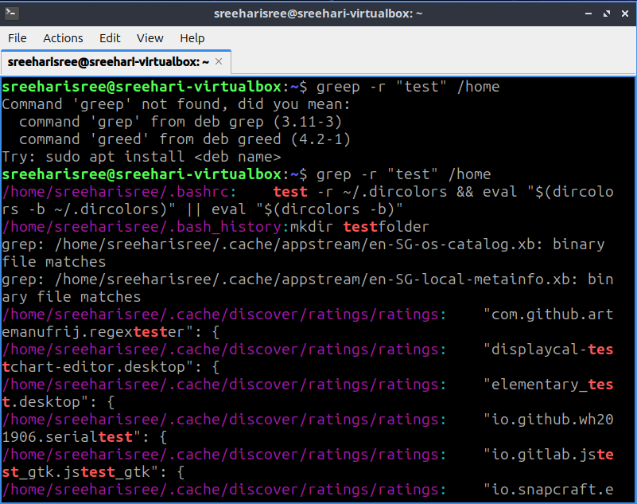
---
## Reflection
In this session, I learned how Linux manages services, file permissions, and file searching. These are important for system administration and security.
---
# Session 2a: Total Cost of Ownership
## Objective
Compare cost of cloud vs on-premise infrastructure.
### Analysis
On-premise requires upfront cost (hardware, maintenance).
Cloud has lower upfront cost but recurring monthly charges.
### Screenshot
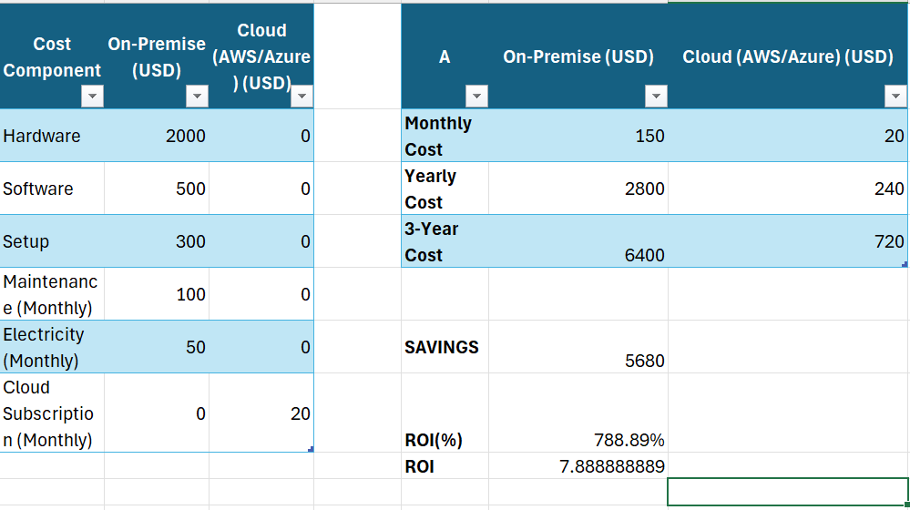
### Reflection
I learned that cloud computing is more flexible and cost-efficient for small-scale systems.
---
# Session 2b: Cloud & Scripting
## Cloud Setup (AWS EC2)
I created a cloud-based Ubuntu server using AWS EC2.
This allows remote access to a virtual server environment.
### Screenshot
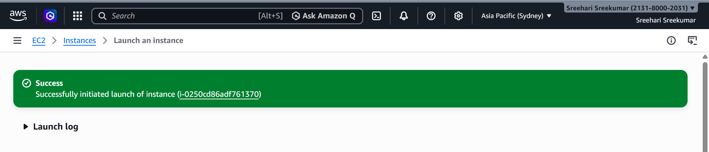
---
## SSH Connection
I connected to the server using SSH, which allows secure remote access.
### Command Used
ssh -i key.pem ubuntu@public-ip
### Screenshot
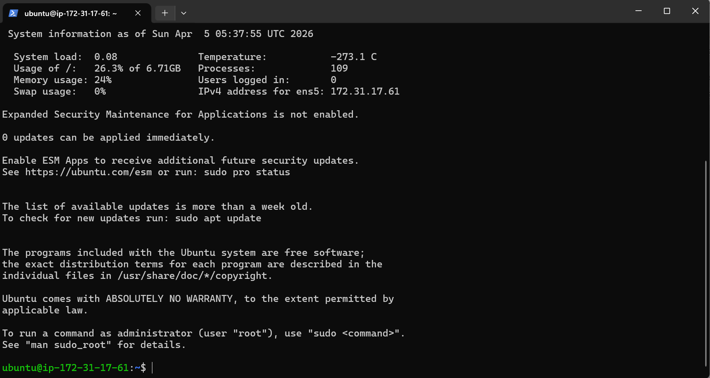
---
## Bash Scripting
I created a simple bash script to display server status and time.
### Script
#!/bin/bash
echo "Server is running"
echo "Current date and time:"
date
### Screenshot
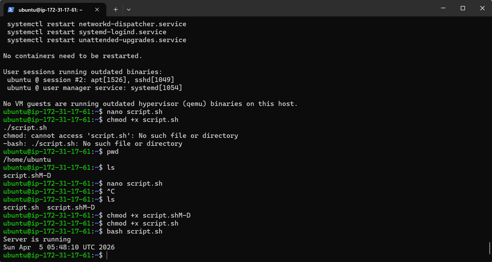
---
## Reflection
In this session, I learned how to create and access a cloud server using AWS.
I also learned how to automate tasks using bash scripting.
This is important for system administration and DevOps roles.
---
# Session 3a: DNS & SSL
## DNS
I used nslookup to check how domain names resolve to IP addresses.
### Command
nslookup google.com
### Screenshot
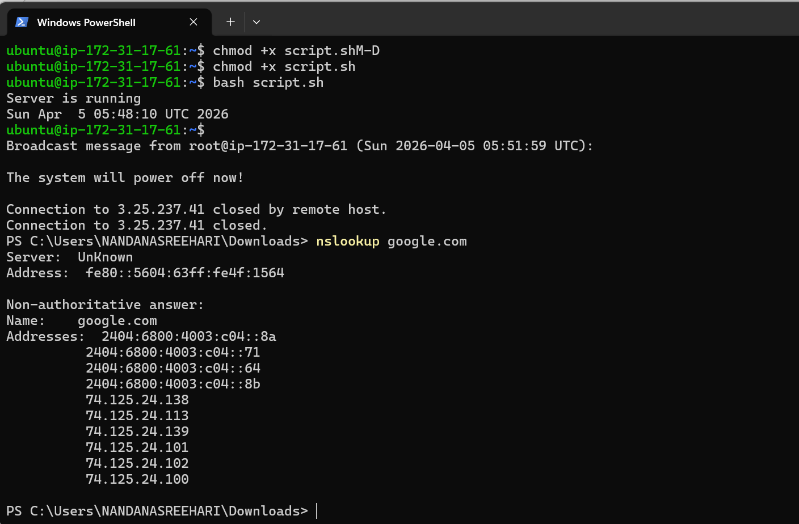
---
## Web Server Setup
I installed Apache web server and accessed it using the public IP.
### Screenshot
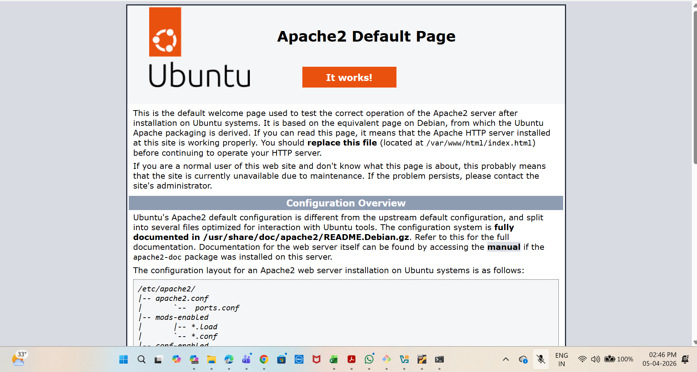
---
## SSL Setup Attempt
I attempted to configure SSL using Certbot.
### Command
sudo certbot --apache
### Result
The SSL setup failed because a valid domain name is required.
### Screenshot
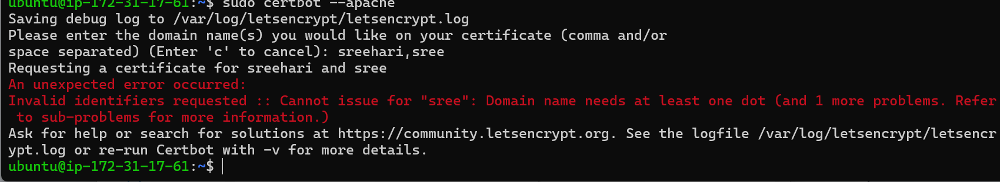
### Explanation
SSL certificates require a valid domain name (e.g., example.com). Since I used a placeholder name, the certificate could not be issued.
### Reflection
This helped me understand that SSL is dependent on proper domain configuration and cannot be applied directly to an IP address.
---
# Session 3b: Automation
## Script Creation
I created a bash script to automate system updates and log the output into a file.
### Script
```bash
#!/bin/bash
echo "Update started at $(date)" >> /home/ubuntu/update.log
sudo apt update >> /home/ubuntu/update.log
echo "Update finished at $(date)" >> /home/ubuntu/update.log
```
---
## Script Testing
I executed the script manually to verify that it runs correctly and logs the output.
### Command Used
```bash
./auto.sh
cat /home/ubuntu/update.log
```
### Screenshot

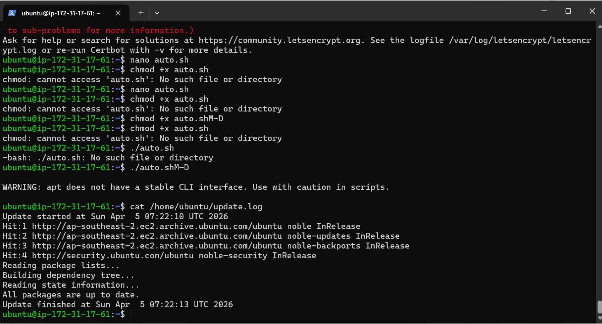

---
## Cron Job Setup
I configured a cron job to automate the execution of the script every minute.
### Command
```bash
crontab -e
```
### Cron Entry
```bash
* * * * * /home/ubuntu/auto.sh
```
### Screenshot

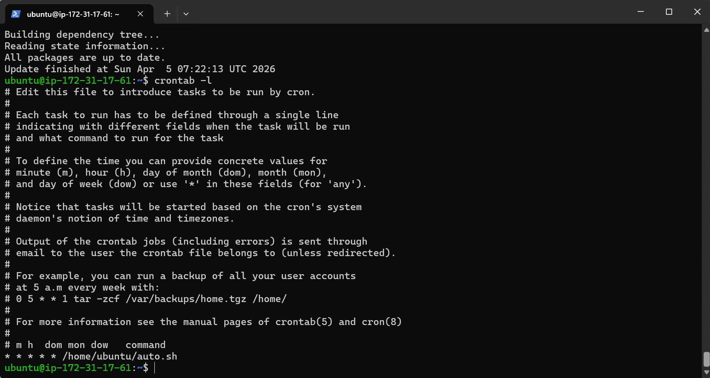

---
## Log Output Verification
After waiting for a few minutes, I checked the log file to confirm that the script was running automatically.
### Command

```bash
cat /home/ubuntu/update.log
```
### Screenshot

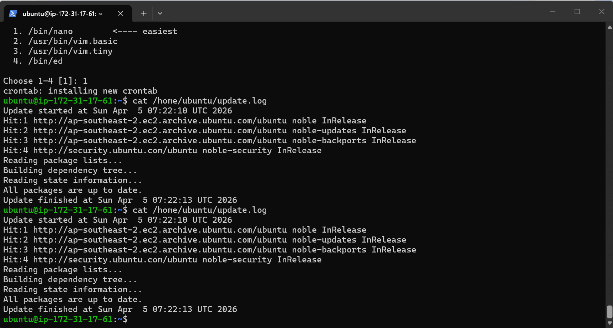

---
## Reflection
In this session, I learned how to automate repetitive server tasks using cron jobs.
This is an important concept in system administration and DevOps, as it allows tasks such as updates, backups, and monitoring to run automatically without manual intervention.
---
# Session 4: Additional Server Service (MySQL)
## Objective
Install and configure an additional server service.
---
## MySQL Installation
I installed MySQL server using the package manager.
### Command
sudo apt install mysql-server -y
---
## Service Status
I verified that the MySQL service is running.
### Command
sudo systemctl status mysql
### Screenshot

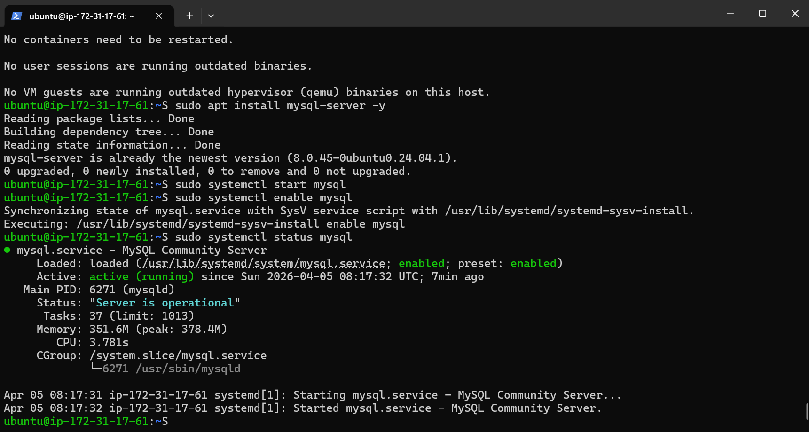

---

## Database Operations
I accessed MySQL and created a test database.
### Commands
SHOW DATABASES;
CREATE DATABASE labtest;
SHOW DATABASES;
### Screenshot

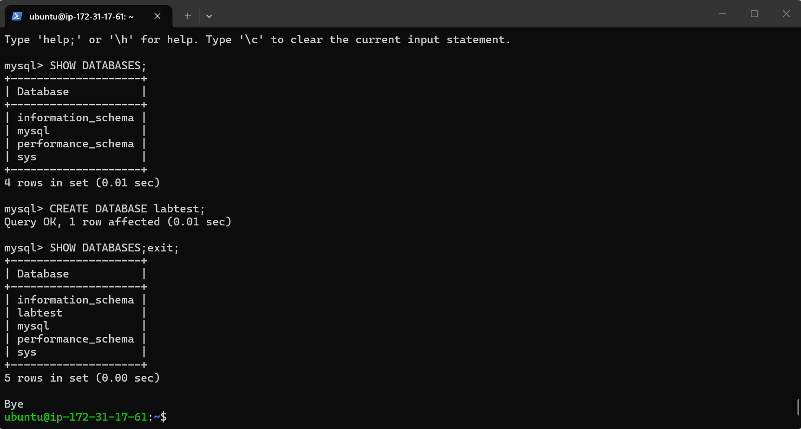

---
## Reflection
In this session, I learned how to install and manage a database server.
This helped me understand how backend services store and manage data in real-world systems.
---
